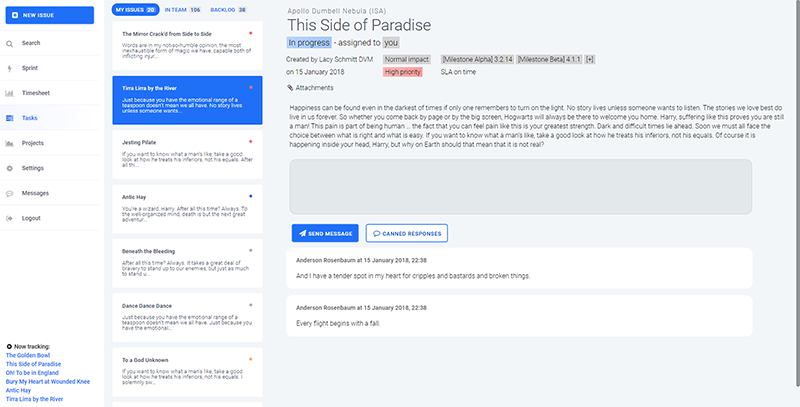

# Relay AI

A project management tool that incorporates everything I've learned about working on software in various teams. Along with learning the expertise of team members and assigning relevant tasks to the right people, Relay AI takes into account everyone's workload to plan tasks, easily tracks time spent on projects, and simplifies things like: sprint planning, daily standup meetings, meeting SLA standards, and following up on replies. 
 
Primary technologies used are Kotlin, Java 8, SASS, JOOQ and jQuery. It runs as a self-contained JAR with Spring Boot on AWS. You can see a running demo of the latest minor release at: https://www.relayai.io

Monitoring is done internally with JavaMelody APM, and is available at: https://www.relayai.io/monitoring

Documentation is available at: https://kevindeyne.github.io/relayai-docs

Take note: This project is an alpha-stage (feature incomplete) work in progress. It is not ready for use in a production environment. Flyway database scripts may change drastically as the project moves into further stages of development. Expect frequent commits and rewrites.

  

## Key Features

* Learns the expertise of team members and assigns relevant tasks to the right people
* Takes into account workload to plan tasks
* Has easy tracking of time spent on an issue
* Simplifies sprint planning, daily standup meetings, guides smaller teams into working more agile
* Provides priority help with SLAs, replies, problems
* Opens up the issue tracker for clients and project leaders, while keeping its workflows focussed on the developers and testers
 
## Implemented features 
 
* Task list with overload, in-progress, importance tagging, dynamic re-ordering 
* Sprint screen with statistics
* User details/security input 
* New issue tagcloud interpretation
* User knowledge tagcloud
* Auto-assignment of new issues and at sprint startup 
* In progress tracker, on all pages
* Search issues
* Pulling mechanism for counters and dynamic live issue/comment loading 
* Basic chat/comment functionality 
* Responsive layout
* Dynamic importance sorting 
* Categorizing new issues in to "backlog, needs more info or critical"
* Sprint info/backlog
* Sprint closing/starting
* Separation of task list into "My issues, backlog, team issues" 
* Visualize current project 
* Project switching
* Project page with settings
* Workload interpretation 
* *  Setting average work day: which days, how long (on user), sprint length (on project) 
* *  Reconfiguration sprint (based on importance) 
* Arrive on the project with no active project, force the user to start new project 
* Separate page for shareholders
* Sprint / project statistics
* HTTPS setup 
* Branching 
* Intro page (html with check if online) 
* Timesheet re-write
* Login honeypot for bots
* Initial security pass
* Registration and activation
* Landing page details
 
### Upcoming milestone plan
* Manual ticket assignments
* Shareholder page
* Dynamic sprint info
* Dynamic changelogs
* Settings: Project time zone, Time zone setting for issues, when average day starts/ends (automatically)
* Project, invite people through unique, timed, link 
* IntroJS
* Standup meeting daily or weekly 
* AJAX call 404 error follow-up (refresh)
* Validation pass
* localstorage updates via tabs in pulling (implemented, to test)
* Algorithm efficiency in aside re-ordering
* Security rules via interceptors / method-level

### Nice to have
* Follow-up (auto-reminder after inaction) 
* Canned responses
* Attachments to issues
* Comments should contain user role
* Similar issues
* History tab
* Option to redistribute work when working on development/on holiday 

## Built With 
 
* [Spring Boot](https://projects.spring.io/spring-boot/) - Application framework used 
* [JOOQ](https://www.jooq.org/) - Type-safe, database first DSL for SQL queries (highly recommended alternative to ORMs) 
* [BoneCP](http://jolbox.com) - Fast, open-source, Java database connection pool 
* [Stanford Language Processing Libraries](https://nlp.stanford.edu/software/) - Greatly increases the accuracy of the internal keyword generation 
* [Apache ActiveMQ](http://activemq.apache.org/) - Open source messaging server, integrated into Spring Boot 
* [Kotlin](https://kotlinlang.org/) - Statically typed, concise and safe programming language 
* [JavaFaker](https://github.com/DiUS/java-faker) - Fake data generator for realistic testing 
* [Maven](https://maven.apache.org/) - Dependency Management 
 
## Contributing 
 
Until feature completion, there are no concrete plans to open up development to non-core team members. If you feel contributions are necessary, feel free to contact Kevin Deyne. Once feature complete and ready for beta release, the project will be available open-source and development will be opened up in the interest of feature requests, integrations and bugfixes.
 
## Authors 
 
* **Kevin Deyne** - *Lead development* - (https://github.com/kevindeyne) 
 
## License 
 
This project is licensed under the Mozilla Public License 2.0 - see the [LICENSE.md](https://github.com/kevindeyne/tasker/blob/master/LICENSE) file for details 